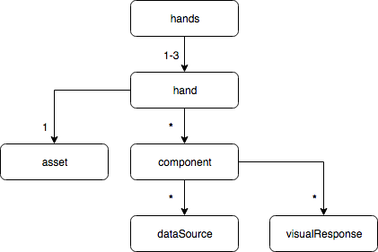

# Gamepad Mapping

## Motivation
> **TODO** Explain what WebXR is and how its different from WebVR

> **TODO** Define motion controllers

When a motion controller is present on XR hardware, developers often wish to do the following:
1. Display the motion controller's virtual model at the correct location
1. Find out the state of the controller's component parts (made up of buttons and axes)
1. Modify the virtual model to reflect the state of the components each render frame
1. Provide a key or legend that explains the mapping of components to actions

The state of an XR motion controller's buttons, thumbsticks, dpads, and touchpads is made available to developers via a `Gamepad` object, as defined by the [Gamepad API](https://www.w3.org/TR/gamepad/). This data is divided up and populated in the `Gamepad.buttons` array and the `Gamepad.axes` array. While this system was adequate for the relatively homogenous console gaming controllers, it breaks down for XR motion controllers as they have not yet converged on a common form factor. In addition, the [Gamepad API](https://www.w3.org/TR/gamepad/) does not provide any information about the visualization of a `Gamepad` object which is a requirement to displaying a virtual copy of motion controller on opaque XR headsets.

## Overview
This repository defines a JSON schema to bridge the gap between the needs listed above and the abstract data reported by `Gamepad` objects. For each known motion controller, there is a folder in this repository at `./mappings/<Gamepad.id>/`.  In this folder is a `mapping.json` file which enumerates how to interpret the `Gamepad` data, paths to included 3D asset files representing the `Gamepad`, and the metadata necessary bind them together. Assets are available under MIT license in .glTF or .glB  format with a schema extension to be defined so additional formats may also be made available in the future.

## Design Goals
This repository has been designed to meet the following goals:
* *Distributable and modifiable.* The content in this repository is available under MIT licence.  Take this schema and modify it for your own purposes.
* *Forward compatible.* The schema, validation tests, and tools are designed to make it straightforward to submit a pull request with new mapping files and assets as new XR hardware comes on the market.  Additionally, fallback assets and mappings are included to handle unknown motion controllers.
* *No custom code necessary.* The schema enables enumerating all hardware metadata necessary to write a single code path for handling motion controller hardware.  Developers should not need to add code checks for specific `Gamepad.id` as aberrant user agent behavior is also documentable in the schema as bugs are discovered.
* *WebXR optimized, WebVR compatible.* While WebVR is still available in several user agents, the future of XR on the web is in the standards-track API, WebXR. As such, when faced with tradeoffs, the design was optimized to simplify the schema for WebXR usage while still maintaining a path for WebVR usage.

## Adding New Hardware
> **TODO** fill in the steps for adding a folder for a new XR device, testing the change, and submitting for PR

> **TODO** Create an issue template for new hardware PRs

## Filing A Bug
> **TODO** fill in the steps for filing a bug

> **TODO** Create an issue template for bugs

# Concepts


## Data Sources
Motion controllers are made up of various parts such as thumbsticks, touchpads, triggers, buttons, or dpads.  The [Gamepad API](https://www.w3.org/TR/gamepad/) communicates the state of these parts via the `Gamepad.buttons` array and the `Gamepad.axes` array. However, a single physical part is divided into separate, unrelated attributes. 

For example, a thumbstick's left-right motion is communicated as a double value in an entry in the `Gamepad.axes` array while the top-bottom motion is in a separate `Gamepad.axes` entry. Furthermore if the thumbstick can be clicked straight down, that pressed/touched/value information is communicated by a `GamepadButton` in the `Gamepad.buttons` array.  The `Gamepad` does not provide any indication that these three array entries are related in any way, despite all representing different aspects of the same physical part.

Each element in the `dataSources` array provides the missing information necessary to group the related parts of a `Gamepad` object back together.  All entries in the `dataSources` array must include an `id` property which is unique among all other entries in the array.  For clarity sake, a `dataSourceType` is also included to indicate which subschema is being used to describe the physical properties of a single part.

### Buttons
A single button (including analog triggers and touchable thumbrests) is represented by an entry in the `dataSources` array with the `dataSourceType` property set to `buttonSource`.  It must also include a `buttonIndex` property with a value representing the index in the `Gamepad.buttons` array at which to find the button's data.  For example:

```json
{
    "gamepad" : {
        "dataSources" : [
            {
                "id" : "gripButton",
                "dataSourceType" : "buttonSource",
                "buttonIndex" : 2
            }
        ]
    }
}
```

When representing an analog button such as a trigger, the `analogValues` property must be present and set to `true`.  For example:

```json
{
    "gamepad" : {
        "dataSources" : [
            {
                "id" : "triggerButton",
                "dataSourceType" : "buttonSource",
                "buttonIndex" : 0,
                "analogValues" : true
            }
        ]
    }
}
```

When representing a button that can report a touched state but not a pressed state (eg. the thumbrest on the Oculus Touch), the `pressUnsupported` property must be present and set to `true`.  For example:

```json
{
    "gamepad" : {
        "dataSources" : [
            {
                "id" : "thumbrest",
                "dataSourceType" : "buttonSource",
                "buttonIndex" : 5,
                "pressUnsupported" : true
            }
        ]
    }
}
```

### Dpads
A dpad is a physical part that rocks in two directions, left-right and top-bottom button. These parts are built such that only adjacent directions can be depressed at the same time.  For example, a dpad could be pressed in the top and left directions at the same time, but could not be pressed in the left and right directions at the same time.

The `standard` mapping defined in the [Gamepad API](https://www.w3.org/TR/gamepad/#remapping) suggests that dpad parts should be divided into four separate entries in the `Gamepad.buttons` array.  It has been observed, however, that some hardware may report dpads as two entries in the `Gamepad.axes` array instead.  As a result, this schema provides two different subschemas that may be used to represent dpads.

#### Dpads From Buttons
A data source of this type is defined as one with the `dataSourceType` property set to `dpadFromButtonsSource`. It must include `leftButtonIndex`, `rightButtonIndex`, `topButtonIndex`, and `bottomButtonIndex` properties with values representing the indices in the `Gamepad.buttons` array at which to find the related data.  For example:

```json
{
    "gamepad" : {
        "dataSources" : [
            {
                "id" : "dpad",
                "type": "dpadFromButtonsSource",
                "leftButtonIndex" : 3,
                "rightButtonIndex" : 4,
                "bottomButtonIndex" : 5,
                "topButtonIndex" : 6
            }
        ]
    }
}
```

Additionally, if any of the `GamepadButton` entries referenced by this data source are capable of reporting analog values, the `analogValues` property must be present and set to `true`.

#### Dpads From Axes
A data source of this type is defined as one with the `dataSourceType` property set to `dpadFromAxesSource`. It must include `xAxisIndex` and `yAxisIndex` properties with values representing the indices in the `Gamepad.axes` array at which to find the related data.  For example:

```json
{
    "gamepad" : {
        "dataSources" : [
            {
                "id" : "dpad",
                "type": "dpadFromAxesSource",
                "xAxisIndex" : 2,
                "yAxisIndex" : 3
            }
        ]
    }
}
```

### Thumbsticks And Touchpads
Thumbsticks are a physical part sticking up from the surface of a controller which can be rocked left/right and top/bottom with a circular range.  Often, thumbsticks can also be depressed in a button-like manner.  Touchpads are a physical part, usually circular, that are able to detect the position of a finger placed on their surface.  Often, touchpads can be depressed in the middle in a button-lime manner or at the edges in a dpad-like manner.

Both thumbsticks and touchpads are represented by an entry in the `dataSources` array with the `dataSourceType` property set to `thumbstickSource` and `touchpadSource` respectively.  Both variations must include `xAxisIndex` and `yAxisIndex` properties with values representing the indices in the `Gamepad.axes` array at which to find the related data.  For example:

```json
{
    "gamepad" : {
        "dataSources" : [
            {
                "id" : "touchpad",
                "type": "touchpadSource",
                "xAxisIndex" : 0,
                "yAxisIndex" : 1
            }
        ]
    }
}
```

Some thumbsticks and touchpads may be able to be depressed or they may also have a center deadzone in which axis data isn't reported but a "touched" status is.  In both cases, the data source must also include a `buttonIndex` property with a value representing the index in the `Gamepad.buttons` array at which to find the button's data. On touchpads with a dpad-like physical behavior, the x-axis and y-axis values can be used to determine which quadrant(s) are being pressed. For example:

```json
{
    "gamepad" : {
        "dataSources" : [
            {
                "id" : "thumbstick",
                "type": "thumbstickSource",
                "xAxisIndex" : 0,
                "yAxisIndex" : 1,
                "buttonIndex" : 1
            }
        ]
    }
}
```

If the thumbstick or touchpad is able to be depressed in an analog manner, the data source must also include an `analogButtonValues` property with a value of `true`.  If the thumbstick or touchpad is capable of reporting a deadzone "touched" status but cannot be pressed, the data source must also include a `pressUnsupported` property with a value of `true`.

## Visual Responses
The visual representation of a motion controller in a VR must respond to reflect its physical state in the real-world.  For example, when a physical thumbstick is moved to the left, the virtual thumbstick should also move to the left.  In order to do this without requiring custom code for each `Gamepad.id`, the schema defines an array of `visualResponse` objects.

Each `visualResponse` must contain a `target` property which references the node in an asset to be modified.  Each `visualResponse` must also contain a `userAction` property set to either `onTouch` or `onPress`.  A `userAction` set to `onTouch` indicates the visual response is describing the desired state of `target` when the associated `GamepadButton.touched` is `true` or the associated elements in the `Gamepad.axes` array are non-zero.  A `userAction` set to `onPress` indicates the visual response is describing the desired state of `target` when the associated `GamepadButton.pressed` is `true`. When `visualResponse` objects have the same `target`, node properties described by a `userAction` equal to `onPress` will take precedence over those with a `userAction` of `onTouch`.

In addition to the `target` and `userAction` properties, a `visualResponse` must have one of the following groups of properties.  Each property represents a node in the asset at the extent of the value which is it matched to:
* `buttonMin` and `buttonMax`
* `left`, `right`, `bottom`, and `top`
* `left`, `right`, `bottom`, `top`, `buttonMin`, and `buttonMax`

For example, a button part would have a `buttonMin` representing the visual state of `target` when the button is not being interacted with and a `buttonMax` representing the visual state of `target` when the button is fully pressed.  Developers are then able to interpolate the correct visualization of `target` by weighting `buttonMin` and `buttonMax` based on `GamepadButton.value`.  The javascript library shipped as part of this package includes this calculation.

### Button Visual Responses
Visual responses for button parts are expected to interpolate `target` properties based on the associated `GamepadButton.value` attribute. For example:

```json
{
    "gamepad" : {
        "visualResponses" : [
            {
                "userAction": "onTouch",
                "target" : "trigger-root",
                "buttonMin" : "trigger-transform-buttonMin",
                "buttonMax" : "trigger-transform-buttonMax"
            }
        ]
    }
}
```

### Dpad Visual Responses
Physical dpad parts rock around a central pivot, requiring their visual responses to interpolate between `left` and `right` as well as `bottom` and `top`.  The expected interpolation is different when associated based on a `dpadFromButtonSource` as opposed to a `dpadFromAxes`.  When associated with the former, `right` is weighted by the `GamepadButton.value` associated with the `rightButtonIndex`, `bottom` is weighted by the `GamepadButton.value` associated with the `bottomButtonIndex`, and so on.  When associated with the latter type of data source, the algorithm is a bit more complicated.  Only positive values in `Gamepad.axes` array at the `xAxisIndex` position are used for interpolation with the `right` node whereas only the absolute value of negative values are used for interpolation with the `left` node.  The same behavior applies to `top` and `bottom` regarding the data at the `yAxisIndex` in the `Gamepad.axes` array. In this manner, both types of data sources can be associated with a single type of visual response.  For example:

```json
{
    "gamepad" : {
        "visualResponses" : [
            {
                "userAction": "onTouch",
                "target" : "dpad-root",
                "left" : "dpad-transform-leftmost",
                "right" : "dpad-transform-rightmost",
                "bottom" : "dpad-transform-bottommost",
                "top" : "dpad-transform-topmost"
            }
        ]
    }
}
```

### Thumbstick Visual Responses
Thumbsticks share physical characteristics with dpad, though they typically have a wider range of motion and may also be clickable.  For interpolating the `target` properties, only positive values in `Gamepad.axes` array at the `xAxisIndex` position are used with the `right` node, whereas only the absolute value of negative values are used with the `left` node.  The same behavior applies to `top` and `bottom` regarding the data at the `yAxisIndex` in the `Gamepad.axes` array. If clickable, `target` properties are also interpolated with `buttonMin` and `buttonMax` based on `GamepadButton.value`.  For example:

```json
{
    "gamepad" : {
        "visualResponses" : [
            {
                "userAction": "onTouch",
                "target" : "thumbstick-root",
                "left" : "thumbstick-transform-leftmost",
                "right" : "thumbstick-transform-rightmost",
                "bottom" : "thumbstick-transform-bottommost",
                "top" : "thumbstick-transform-topmost",
                "buttonMin" : "thumbstick-transform-buttonMin",
                "buttonMax" : "thumbstick-transform-buttonMax"
            }
        ]
    }
}
```

### Touchpad Visual Responses
Thumbsticks share physical characteristics with dpad, though they may also be clickable.  Whereas all other data source types may use a `userAction` of `onTouch` for all visualizations, touchpad data sources will most likely only use an `onTouch` visualization to represent the touch-dot of the user's finger on the part.  Any motion of the touchpad itself due to being clickable, will likely be represented in a visualization with the `userAction` set to `onPress`.

In either case, the algorithm for interpolating the `target` properties is roughly the same.  Only positive values in `Gamepad.axes` array at the `xAxisIndex` position are used with the `right` node, whereas only the absolute value of negative values are used with the `left` node.  The same behavior applies to `top` and `bottom` regarding the data at the `yAxisIndex` in the `Gamepad.axes` array. If clickable, response visualizations with a `userAction` set to `onPress` may also interpolate `buttonMin` and `buttonMax` based on `GamepadButton.value`.  For example:

```json
{
    "gamepad" : {
        "visualResponses" : [
            {
                "userAction": "onTouch",
                "target" : "touchpadDot-root",
                "left" : "touchpadDot-transform-leftmost",
                "right" : "touchpadDot-transform-rightmost",
                "bottom" : "touchpadDot-transform-bottommost",
                "top" : "touchpadDot-transform-topmost"
            },
            {
                "userAction": "onPress",
                "target" : "touchpad-root",
                "left" : "touchpad-transform-leftmost",
                "right" : "touchpad-transform-rightmost",
                "bottom" : "touchpad-transform-bottommost",
                "top" : "touchpad-transform-topmost",
                "buttonMin" : "touchpad-transform-buttonMin",
                "buttonMax" : "touchpad-transform-buttonMax"
            }
        ]
    }
}
```

## Components
Components connect a dataSource with the information necessary to correctly visualize it. A component must contain a `dataSource` property which points to an index in the file's `dataSources` array. It must also contain a `root` property which references the topmost node in an asset hierarchy that is associated with the physical part. A component mut also contain a `labelTransform` property which references a node in the asset hierarchy at which a legend label could be placed.  It is expected that this node is located a safe distance from the body of the motion controller and oriented in a position appropriate for a label to be read.

For example, here is component mapping for a single button.
```json
{
    "gamepad" : {
        "components" : [
            {
                "dataSource" : 4,
                "root" : "trigger-root",
                "labelTransform" : "trigger-label-transform"
            }
        ],
        "dataSources" : [
            {
                "id" : "triggerButton",
                "dataSourceType" : "buttonSource",
                "buttonIndex" : 2
            }
        ]
    }
}
```

In addition, most components will also include the `visualResponses` array property.  The elements of this array are indices into the file's `visualResponses` array.  For example:

```json
{
    "gamepad" : {
        "components" : [
            {
                "dataSource" : 4,
                "root" : "trigger-root",
                "labelTransform" : "trigger-label-transform",
                "visualResponses" : [0]
            }
        ],
        "dataSources" : [
            {
                "id" : "triggerButton",
                "dataSourceType" : "buttonSource",
                "buttonIndex" : 2
            }
        ],
        "visualResponses" : [
            {
                "userAction": "onTouch",
                "target" : "trigger-root",
                "buttonMin" : "trigger-transform-buttonMin",
                "buttonMax" : "trigger-transform-buttonMax"
            }
        ]
    }
}
```

## Handedness
Handedness objects connect component parts with the information necessary to correctly visualize entire motion controllers.  The `handedness` object must be populated by properties in one of the following configurations:

* *`left` and `right`.* This option should be used when the underlying XR platform is expected to always report a handedness.  This may be because the motion controllers are intrinsically unique such as the Oculus Touch.  It may also be due to a system-level configuration setting which causes an intrinsically unhanded controller to report itself as either left or right such as the Google Daydream Controller.
* *`none`.* This option should be used for motion controllers which are incapable of reporting handedness.  It does not imply that only one motion controller will be tracked at a time.
* *`none`, `left`, and `right`.* This options should be used for motion controllers that are capable of but not guaranteed to report handedness. For example, HTC Vive Controllers are not intrinsically handed, but the underlying XR system is able to interpret usage based on relative position over time.  As a result, these controllers are capable of reporting all three types of handedness.

All three of these properties are the same type and must contain an `asset`, a `root`, and a `components` property.  The `asset` property points to a .glTF or .glB file representing the motion controller; extensions will be made available for additional file formats.  The `root` property references the topmost node in the asset hierarchy associated with the motion controller.  The `components` array must not be empty and contains indices into the file's `components` array.

For example:

```json
{
    "gamepad" : {
        "id" : "motion-controller-id",
        "handedness" : {
            "none" : {
                "asset" : "some-url",
                "root" : "none-handedness-controller",
                "components" : [0]
            }
        }
    }
}
```

The `none`, `left`, and `right` objects may also contain two additional properties.  When present, the `primaryButtonComponent` property contains the index into the file's `components` array at which position the motion controller's "default" button can be found.  For many motion controllers this is a trigger-style button.  When present, the `primaryAxesComponent` property contains the index into the file's `components` array at which position the motion controller's "default" thumbstick or touchpad can be found.

```json
{
    "gamepad" : {
        "id" : "motion-controller-id",
        "handedness" : {
            "none" : {
                "asset" : "some-url",
                "root" : "none-handedness-controller",
                "components" : [0],
                "primaryButtonComponent" : 0,
                "primaryAxisComponent" : 1
            }
        }
    }
}
```

# Appendices

## Licence
Per the [LICENSE.md](LICENCE.md) file, this repository is made available under an MIT license and is copyright Amazon 2019.

## Hardware

### Supported
* [Gear VR](mappings/GearVR)
* [HTC Vive Controller](mappings/HTCViveController)
* [Oculus Go](mappings/OculusGo)
* [Oculus Touch](mappings/OculusTouch)
* [Windows Mixed Reality](mappings/045E-065D)

### Missing Mapping and/or Assets
* Google Daydream
* Google Mirage Solo
* HTC Vive Focus
* Magic Leap One
* Oculus Quest
* Valve Knuckles
* Windows Mixed Reality for Samsung Odyssey

## References
* [GitHub - stewdio/THREE.VRController: Support hand controllers for Oculus, Vive, Windows Mixed Reality, Daydream, GearVR, and more by adding VRController to your existing Three.js-based WebVR project.](https://github.com/stewdio/THREE.VRController)
* [assets/controllers at gh-pages · aframevr/assets · GitHub](https://github.com/aframevr/assets/tree/gh-pages/controllers)
* [Unity - Manual:  Input for OpenVR controllers](https://docs.unity3d.com/Manual/OpenVRControllers.html)
* [Steam VR Template -        Unreal Engine Forums](https://forums.unrealengine.com/development-discussion/vr-ar-development/78620-steam-vr-template?106609-Steam-VR-Template=)
* [Mapping Oculus Controller Input to Blueprint Events](https://developer.oculus.com/documentation/unreal/latest/concepts/unreal-controller-input-mapping-reference/)