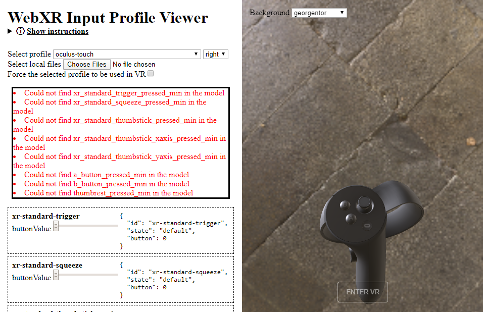

# Preparing a WebXR input profile mesh

This brief tutorial will go over how to prepare a mesh for use with the WebXR input profiles libraries (referred to as an "Asset" through the remainder of this document). It will demonstrate using [Blender 2.8](https://www.blender.org/) to work with the meshes, but any 3D modeling package that can export binary glTF 2.0 files (.glb) should work as the basic steps apply everywhere.

## Add the input device to the registry
New assets must match a profile a profiles id in the [`registry`](../../registry) package. If the input device you are preparing an asset for doesn't already have a registry entry, create one first. You can submit it as part of the same pull request as the asset files.

## Add a `profile.json`
Under the [`profiles`](../profiles) directory of this package create a new directory for your asset with the name of the `profileId` from the corresponding registry .json file. In that directory create a `profile.json` file that also contains, at minimum, the same `profileId` as the registry entry.

In this example I'll be preparing assets for the 1st gen Oculus Touch controllers, which already had a registry entry indicating their `profileId` is `oculus-touch`. As a result I created a `oculus-touch` directory under [`profiles`](../profiles) and then added a `profiles.json` file to it with the following content:

```json
{
    "profileId" : "oculus-touch",
    "overrides" : {}
}
```

The `overrides` dictionary is for changing any of the values or defaults from the registry .json for the purposes of asset loading. One of the most common cases would be if the input device you are preparing does not have a separate design for the user's left and right hand, it's more practical to prepare a single asset and use it for all handedness types (`left`, `right`, and `none`). This is the case for the HTC Vive controller, for example, and as such only an asset for the `none` handedness was created, and then the `left` and `right` handedness were instructed to use it like so:

```json
{
    "profileId" : "htc-vive",
    "overrides" : {
        "left-right": {
            "rootNodeName": "htc_vive_none",
            "assetPath": "none.glb"
        }
    }
}
```

## Create and test a static .glb file
To ensure that the profile is set up correctly so far and make sure our tooling is working, next we'll do a simple export of the un-rigged asset and try to load it in the [Profile Viewer](https://immersive-web.github.io/webxr-input-profiles/packages/viewer/dist/index.html)

First, load the mesh you're going to be using (this is, sadly, not a modeling tutorial. I'm assuming you already have a mesh available or are able to create one without my assistance.)


*IMPORTANT NOTE:* Please keep in mind the performance limitation and graphical fidelity of the platform the input device is associated with when selecting or authoring assets. For example, assets for devices based on mobile chipsets should generally use lower polygon counts and smaller textures, while assets for PC-based headsets should strive to be a bit more detailed in both geometry and material. In all cases the assets should attempt to resemble the physical input device as much as possible. Submitted assets that have excessively high polygon counts, overly large textures, or which are too stylized are likely to be rejected. Exceptions for stylized assets will be made if they match the style used throughout the devices platform.

One the mesh is ready select the `File > Export > glTF 2.0 (.glb/gltf)` menu option.


Make sure the format is `glTF Binary (.glb)` and export the file to the `packages\assets\profiles\<profileId>` folder that you placed the `profile.json` in as `<handedness>.glb`. In my case since I'm working with a mesh of the right-handed touch controller I export the resource as `right.glb`.


Next, just for the purposes of testing, you'll want to copy the regitry .json file that corresponds to your asset into the `packages\assets\profiles\<profileId>` folder. This allows it to be loaded by the web tool much more easily. This file should not be checked in at that location once you're ready to submit your pull request!

Now navigate your browser to [https://immersive-web.github.io/webxr-input-profiles/packages/viewer/dist/index.html](https://immersive-web.github.io/webxr-input-profiles/packages/viewer/dist/index.html), which is a tool for viewing existing assets for the profiles already in the registry. To make sure your asset has an appropriate profile and the .glb is exporting as expected, click the "Choose Files" button.


Navigate the dialog to the `packages\assets\profiles\<profileId>` folder and drag or shift-select both .json files and the .glb, then click "Open"


The viewer should now load up your asset and display it in the right-hand preview window, as well as show various controls and diagnostics on the left side of the page. If it did not display you may need to change the handedness in the dropdown next to the profile selector.



You'll also notice that there's almost certainly a list of errors showing up in red saying things like _"Could not find xr_standard_trigger_pressed_min"_. Don't worry, that's what we're going to fix next! Finally, under the errors is a series of sliders that won't do anything just yet. If you select one of the other existing profiles you'll see that these make various parts of the mesh animate in response to simulated input. Resolving the red errors will allow your asset to respond in the same way.

## Splitting your asset into movable parts

In order for your asset to animate in response to user input, each moving part will need to be a separate mesh. If you're lucky, your asset may have come pre-split, which in Blender outliner looks like this:


In a properly split mesh clicking on each of those triangle icons will highlight only the corresponding component of the input device. If that's the case, congrats! Skip to the next section! Otherwise, for each moving part follow these steps.

Select the mesh with all the combined parts in the outliner, then switch to "Edit Mode" and set "Face Select Mode".


Then on the mesh click or drag select while holding down shift to select all of the faces of the component you want to split out. This... can be tedious. Sorry. I find that selecting several faces and then pressing "Ctrl - Numpad +" to expand the selection to adjacent faces often works well.


Then use the "Mesh > Separate > Selection" menu item to break the component out into it's own mesh in the outliner. Rename it (by double clicking on the mesh name in the outliner) to something that you'll recognize.


## Setting the root node

Most of the rest of the tutorial is going to involve setting up specifically named and carefully placed "nodes" for the glTF file's heirarchy. In Blender, these are represented by creating empty Axes objects, which you can do from the `Add > Empty > Plain Axes` menu item in `Object Mode`.


The first node required is the root node. By default this should be named `<profileId>_<handedness>`, where any dashes (`-`) in the profileId are replaced with underscores (`_`). So because I'm preparing a `right` handed asset for the `oculus-touch` profile the root node's name will be `oculus_touch_right`, which is what the newly created axis (named `Empty` by default) should be renamed to in the outliner.


Finally, all of the meshes should be moved under the root node by selecting them in the outliner and dragging them on top of the new root node while holding down Shift.


Next, we'll set up a series of nodes that describe the motion extents of each component, which is easiest to describe by component type.

## Buttons

If your input device has any simple buttons like the "A" and "B" buttons on the Oculus Touch controller, they tend to be the easiest component to rig. Each moving component needs at minimum three nodes to describe it's motion. A "value", a "min", and a "max". At runtime the value node will be interpolated between the min and the max nodes, based on the value reported by the XRInputSource's gamepad. By extension, any meshes underneath that node in the scene hierarchy will be moved as well, creating our desired animation.

The nodes must be named specifically so that the library can locate them and associate them with the appropriate gamepad inputs. (These names can be overriden if needed in the `profile.json`, but it's typically easiest to just use the default names.)

For a simple button component the default node names are `<buttonName>_pressed_value`, `<buttonName>_pressed_min`, and `<buttonName>_pressed_max` where any dashes (`-`) in the buttonName are replaced with underscores (`_`). To make things easier, the profile viewer page from earlier will also tell you some of the node names it's unable to find. In my case the Oculus Touch's "A" will need a `a_button_pressed_value`, `a_button_pressed_min`, `a_button_pressed_max`.

I typically find it easiest to create the value node first and position it. While it's not required, it's helpful to not only align the value node with the button's center, but also rotate it so that the axis points stright up out of the button.


Once positioned, right click and copy the node in the outliner, then paste two copies and rename them to the "min" and "max" variants respectively, which gives us all three nodes at the same place. In the outliner move those nodes under the "root" node, then move the mesh for the corresponding component and place it under the "max" node.


Now, selecting just the "max" node in the outliner, move the node (which will also move the button) to the position it should be in when fully pressed. If you rotated the axis in a previous step to align with the button's orientation then the movement can be handled more easily by switching from "Global" move controls to "Local", which will allow you to easily slide up and down along the button's axis of movement. If you have the physical hardware on hand as reference try to match the position of the physical buttons when fully pressed to help match the user's tactile experience best.


If the asset you are working with doesn't show the button in a fully unpressed state by default, repeat the above by reparenting and repositioning the button mesh with the "min" node to set the button's fully unpressed state.

Once the button has been positioned, move the button mesh in the outliner to underneath the "value" node instead. This will snap the mesh back to it's original position, but at runtime when the application interpolates the "value" node between the "min" and "max" nodes it will move the button as well.


That's it! The button is now ready to animate! To verify that it's working as intended, export the asset to a .glb again and load it with the model viewer page as described above. There should now be less red errors upon loading the asset and when you interact with the sliders for the button in question you should see it smoothly transition between the "min" and "max" positions.


If the button isn't moving properly ensure that the node names are all correct and that the button mesh is properly parented to the "value" node.

The final node heirarchy for each button after rigging looks like the following, where `a_button` is substituted for the name of the button you are rigging:

  * `a_button_pressed_max`: _Button center when fully pressed_
  * `a_button_pressed_min`: : _Button center_
  * `a_button_pressed_value`: _Button center_
    * ⛛ `a_button_mesh`

Repeat for each button on your device that WebXR exposes.

## Triggers

Triggers are almost handled identically to buttons, with the primary difference than instead of translating they typically pivot on a hinge. Triggers are also likely to fall under the "xr-standard" mapping, which means they will have a default node name of `xr_standard_trigger_pressed_value` and so on.

When rigging a trigger follow all of the above steps for buttons but place the nodes at the point where the trigger should swivel around. It's very helpful to observe the physical hardware here to see if you can determine where it's actually rotating. Then, when placing the mesh under the "max" node, rotate it instead of (or in addition to) translating it to position the trigger in it's appropriate fully pressed state. As with the buttons ensure the mesh is placed under the "value" node once the "max" node has been positioned.


The final node heirarchy you should end up with after rigging the thumbstick should look like this, with all nodes placed at the thumbsticks rotation origin.

  * `xr_standard_trigger_pressed_max`: _Trigger rotation origin position/rotation when fully pressed_
  * `xr_standard_trigger_pressed_min`: : _Trigger rotation origin_
  * `xr_standard_trigger_pressed_value`: _Trigger rotation origin_
    * ⛛ `trigger_mesh`

The same applies to "squeeze" triggers (also sometimes called grip triggers), with the `xr_standard_squeeze` substituted for `xr_standard_trigger`

## Thumbsticks

Thumbsticks are a bit more complicated than buttons and triggers, because we want to show a full range of movement over two axes, as well as sometimes the ability to be pressed like a button.

First, if the thumbstick can be pressed you'll want to set up a `xr_standard_thumbstick_pressed_value` node with the appropriate "min" and "max" counterparts exactly like the button above to animate the thumbstick being pressed.

Next, you'll need to set up an `xr_standard_thumbstick_xaxis_pressed_value` node, also with "min" and "max" counterparts, all of which should be placed underneath `xr_standard_thumbstick_pressed_value` in the outliner heirarchy. As with before, it's helpful if these nodes are rotated to align with the thumbstick itself (with on axis pointing straight up through the middle) and the nodes should ideally be placed at the center of the imaginary "ball" created by the base of the thumbstick, since that's where the physical pivot point most likely is.


Now place the thumbstick mesh underneath the "max" node and rotate it to the right till it's reached the same extent as the physical joystick is capable of.


Repeat with the "min" node, rotating to the left physical extent.


Now copy the `xr_standard_thumbstick_xaxis_pressed_value` node and create three copies to produce the `xr_standard_thumbstick_yaxis_pressed_value` and associate "min"/"max" nodes. (Having them all placed at the same point helps the animation work smoothly.) Place all three new nodes under the `xr_standard_thumbstick_xaxis_pressed_value` node, which allows the animation of the X and Y axis to both affect the thumbstick position.

Now position the Y axis min and max extents in the same way the X axis extents were set, with the Y axis min being pushed forward, away from the user and the Y axis max being pulled back towards the user.

Finally, the thumbstick mesh should be placed under `xr_standard_thumbstick_yaxis_pressed_value` in the outliner heriarchy, as this will allow it to respond to pressing, x axis, and y axis movements. The final node heirarchy you should end up with after rigging the thumbstick should look like this, with all nodes placed at the thumbsticks rotation origin.

  * `xr_standard_thumbstick_pressed_max`: _Thumbstick rotation origin when pressed_
  * `xr_standard_thumbstick_pressed_min`: : _Thumbstick rotation origin_
  * `xr_standard_thumbstick_pressed_value`: _Thumbstick rotation origin_
    * `xr_standard_thumbstick_xaxis_pressed_max`: _Maximum rotation right_
    * `xr_standard_thumbstick_xaxis_pressed_min`: _Maximum rotation left_
    * `xr_standard_thumbstick_xaxis_pressed_value`: _Thumbstick rotation origin_
      * `xr_standard_thumbstick_yaxis_pressed_max`: _Maximum rotation down_
      * `xr_standard_thumbstick_yaxis_pressed_min`: _Maximum rotation up_
      * `xr_standard_thumbstick_yaxis_pressed_value`: _Thumbstick rotation origin_
        * ⛛ `thumbstick_mesh`

## Touchpads

Last we have touchpads, which are the most complex to rig. The Oculus Touch doesn't have one, so I'll use an image of a Valve Index controller instead.


The way touchpads work is that a placeholder node is positioned at the center of the touchpad (shown here in red) which has no mesh associated with it. The application is expected to attach one later for visualization if needed. Then, similar to how the thumbstick is handled, "touched" min/max nodes are placed at the extends of each axis (shown here in yellow). The placeholder node is then transitioned between them at runtime to show where the user is touching. There's also a "pressed" node set that visualizes if the touchpad can be physically clicked. The touchpad mesh should be attached to the "pressed_value" node if it can move.

By this point you should be more familiar with the way that the nodes work, so I'll just provide the node hierarchy and a description of where each goes.

  * `xr_standard_touchpad_pressed_max`: _Touchpad center when pressed_
  * `xr_standard_touchpad_pressed_min`: : _Touchpad center_
  * `xr_standard_touchpad_pressed_value`: _Touchpad center_
    * ⛛ `touchpad_mesh`
    * `xr_standard_touchpad_xaxis_touched_max`: _Touchpad right_
    * `xr_standard_touchpad_xaxis_touched_min`: _Touchpad left_
    * `xr_standard_touchpad_xaxis_touched_value`: _Touchpad center_
      * `xr_standard_touchpad_yaxis_touched_max`: _Touchpad bottom_
      * `xr_standard_touchpad_yaxis_touched_min`: _Touchpad top_
      * `xr_standard_touchpad_yaxis_touched_value`: _Touchpad center_
        * `xr_standard_touchpad_axes_touched_value`: _Placeholder node. Touchpad center_

## Device Position/Scale

The final step is to make sure that the asset is in the right position and is the right size for use in VR. The intent is for the asset to match the size and, position, and orientation of the device in the user's hand. The best way to adjust this is to move, rotate, and scale the "root" node (for me the `oculus_touch_right` node). To display properly the center of the controller's handle should be at the scene
s origin, and the handle should point straight down the "Y" axis (the glTF export will automatically convert this to the -Z axis, as WebXR requires.)


To determine the size, you can use the Measure tool to draw rules over the mesh and see how large it is. Ensure this matches the physical device as closely as possible.


## Finishing up

And that's it! Validate that you see the results you want in the profile viewer, and resolve any remaining errors that it reports. If it reports a missing node for something that doesn't actually have any moving mesh pieces associated with it (such as the thumb rest on the Oculus Touch) the easiest thing to do is simply create the appropriately named nodes and place them anywhere you want without any meshes attached.

It's highly encouraged that you also ensure that the assets look correct in VR prior to submitting them, as it can help expose issues with placement, materials, or component animation that are harder to detect in the 2D viewer window.

Once everything is ready to go, submit a pull request to this repo with the new assets!

Thanks for making the Immersive Web a better place!
